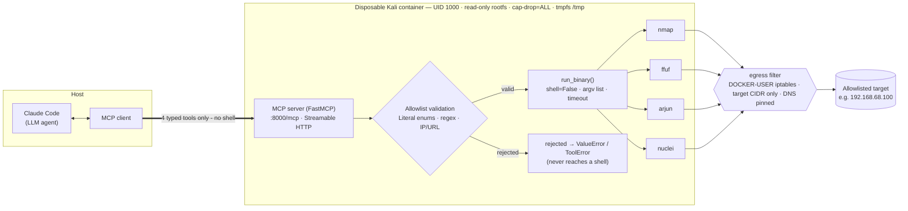

# API-RedBox-MCP

A containerized Kali Linux sandbox that exposes a fixed security toolset to an LLM
over the **Model Context Protocol (MCP)** — so an agent like Claude Code can run
recon/scanning against *published REST APIs* **without ever getting a shell**.

## Pragmatic truth

Giving an LLM unconstrained shell access is a catastrophic risk. This project
enforces boundaries instead. If the agent hallucinates, or hits a prompt-injection
payload inside a target's API response, the blast radius is confined to a
disposable container that can only run four pre-defined tools with validated
arguments — and can only talk to the target you allow.

## Architecture



The host agent never spawns the tools and never reaches a command line. It can
only call four typed tools over HTTP; every call is validated, then executed via
an argv list with `shell=False`, so shell metacharacters are inert.

## Toolset

Each MCP tool maps to exactly one binary with a **closed allowlist** of arguments —
there is no free-form flag / command field anywhere (see [`SPECS.md`](SPECS.md) §3).

| Tool | Purpose | Permitted arguments |
| :--- | :--- | :--- |
| `nmap_scan` | Port verification | target (literal IP only), `-p <ports>` (regex), `-sT`\|`-sV` |
| `ffuf_discover` | Endpoint discovery | target URL (must contain `FUZZ`), wordlist *alias* (local SecLists only) |
| `arjun_params` | Hidden-parameter fuzzing | target URL, method `GET`\|`POST` |
| `nuclei_scan` | Vulnerability scanning | target URL, fixed `-tags rest,api` (templates baked into the image) |

## Output

Every tool returns a structured `ScanResult` rather than raw console text, so the
model gets typed data instead of scraping stdout:

```jsonc
{
  "tool": "nmap",
  "target": "192.168.68.100",
  "command": ["nmap", "-Pn", "-sT", "-p", "80", "-oX", "-", "192.168.68.100"],
  "status": "completed",        // completed | timed_out | error
  "exit_code": 0,
  "findings": [                  // parsed from the tool's native machine format
    {"port": 80, "protocol": "tcp", "state": "open", "service": "http", "version": "1.25"}
  ],
  "raw": "<nmaprun>…</nmaprun>"  // ground truth, always present
}
```

`findings` is parsed from each tool's machine format (nmap XML, ffuf/arjun JSON,
nuclei JSONL); parsing is defensive — malformed output yields `findings: []` while
`raw` is preserved, so a tool/version quirk never turns into a crash.

## Security invariants

These are the reason the project exists; they are not relaxed for convenience.

- **No arbitrary shell.** No tool exposes `/bin/sh -c`, `additionalFlags`, `command`,
  or any passthrough field. A regression test (`test_no_tool_exposes_a_freeform_command_field`)
  fails the build if one ever appears.
- **Two-layer argument validation.** The MCP schema (pydantic `Literal`/regex)
  rejects out-of-allowlist values before handler code runs; the handlers then
  re-validate targets (`_validate_target_ip`, `_validate_http_url`) and select
  wordlists by alias only.
- **Hardcoded target allowlist.** Every tool refuses any target not in
  `ALLOWED_TARGETS` (IPs/CIDR ranges baked into `server.py`); URL hosts must be
  literal allowed IPs and are never resolved. This is the application-layer twin
  of the egress firewall — see [Allowed targets](#allowed-targets).
- **Container hardening.** Base `kalilinux/kali-rolling`; runs as `mcpbot` (UID 1000),
  root disabled; read-only root filesystem; ephemeral `tmpfs` at `/tmp`.
- **Network confinement.** Egress restricted to the target API's IP range; ingress
  limited to port 8000; DNS pinned to an internal resolver to block DNS-tunnel
  exfiltration.

## Allowed targets

Targets are restricted to a hardcoded list in `server.py` — not an env var or a
mounted file, both of which could be overridden at `docker run`:

```python
ALLOWED_TARGETS: tuple[str, ...] = (
    "192.168.68.100",  # add more IPs or CIDR ranges here, e.g. "192.168.68.0/24"
)
```

A tool refuses any IP target — or any URL whose host — that is not covered here,
so the tools cannot be aimed at the public internet or unrelated services. URL
hosts must be literal allowed IPs (hostnames are never resolved). To change the
allowed targets, edit this list and **rebuild the image** (the read-only rootfs
means it cannot be altered at runtime). Pair it with the egress firewall below
for network-level enforcement of the same restriction.

## Build

```bash
docker build -t api-redbox-mcp .   # multi-stage; bakes nuclei templates + a SecLists slice
```

## Run

```bash
# Ephemeral, hardened. nmap uses an unprivileged TCP connect scan (-sT),
# so NO capabilities are required — the container drops them all.
docker run --rm \
  --network target_vlan \
  --add-host api.target.com:203.0.113.10 --dns 0.0.0.0 \
  --user 1000:1000 \
  --cap-drop=ALL --security-opt no-new-privileges \
  --read-only \
  --tmpfs /tmp --tmpfs /home/mcpbot/.cache \
  --pids-limit 256 --memory 1g --cpus 2 \
  -p 127.0.0.1:8000:8000 \
  api-redbox-mcp
```

The MCP server is then reachable at `http://127.0.0.1:8000/mcp` (Streamable HTTP).

## Egress firewall

Restrict the sandbox at the **network layer** too, so the host drops any packet
to a non-target even if something slips past the application allowlist.
[`setup-egress.sh`](setup-egress.sh) installs default-deny `DOCKER-USER` iptables
rules on the Linux host, reading the target CIDRs **from `server.py`** so the two
layers can't drift:

```bash
sudo ./setup-egress.sh --network target_vlan                       # restrict
sudo ./setup-egress.sh --network target_vlan --dns-resolver 10.0.0.53  # + allow one resolver
sudo ./setup-egress.sh --network target_vlan --down                # remove
./setup-egress.sh --subnet 172.30.0.0/16 --dry-run                 # review rules, no root/docker
```

The sandbox subnet may then reach only the allowlisted targets (plus established
replies, and DNS to an explicit resolver if given); everything else is logged
and dropped. DNS is otherwise blocked, which together with `--dns 0.0.0.0` and
`--add-host` closes the DNS-tunnel exfiltration path.

> **Host requirement.** `setup-egress.sh` edits the **host's** netfilter, so it
> needs a Linux Docker host with `iptables`/`DOCKER-USER`. On Docker Desktop
> (macOS/Windows) the container itself runs fine, but there is no host `iptables`
> — the bridge's netfilter lives inside the LinuxKit VM — so the script can't be
> run from the host. Use `--dry-run` to review the rules anywhere; apply them on
> the Linux deployment host. The application-layer `ALLOWED_TARGETS` check in
> `server.py` enforces the same restriction regardless of platform.

## Use from Claude Code (on-demand)

The sandbox is wired into Claude Code **only when you ask for it** — it is not a
default MCP server. [`redbox.mcp.json`](redbox.mcp.json) describes the connection;
a shell launcher loads it for a single session via `--mcp-config`:

```bash
# ~/.zshrc
claudered() {
  if ! nc -z -w1 127.0.0.1 8000 2>/dev/null; then
    echo "⚠️  api-redbox not reachable on 127.0.0.1:8000 — start the container first." >&2
  fi
  claude --mcp-config "$HOME/godz/projects/api-redbox-mcp/redbox.mcp.json" "$@"
}
```

```bash
docker run ... api-redbox-mcp   # 1. start the sandbox (see Run above)
claudered                       # 2. launch Claude Code with the 4 tools loaded
#                                 inside the session, `/mcp` lists `api-redbox`
```

Add `--strict-mcp-config` to the `claude` line for an isolated session exposing
*only* the redbox tools. The MCP loads at session start, so a regular `claude`
session is unaffected.

> **One residual boundary:** the container confines *execution*, but tool *output*
> (e.g. a finding that echoes a target's response) still flows back into the host
> agent's context. Treat all tool output as untrusted.

## Test

Unit tests assert the allowlist/no-passthrough invariants with the real binaries
mocked — no scans run.

```bash
python3 -m venv .venv && .venv/bin/pip install -r requirements.txt -r requirements-dev.txt
.venv/bin/python -m pytest        # 84 tests
.venv/bin/ruff check .            # lint (incl. flake8-bandit security rules)
```

CI (`.github/workflows/ci.yml`) runs `py_compile`, `ruff check`, and the tests on
every push and pull request, and a separate job **builds the Docker image and
verifies nuclei works under the hardened runtime** (templates baked + readable by
the UID-1000 user, config dir writable on the read-only rootfs).

## Layout

| File | Role |
| :--- | :--- |
| `server.py` | The MCP server — all four tools, validators, `run_binary` |
| `test_server.py` | Allowlist / no-passthrough test suite |
| `Dockerfile` | Multi-stage hardened Kali build |
| `setup-egress.sh` | Host `DOCKER-USER` iptables egress lockdown (reads the allowlist from `server.py`) |
| `redbox.mcp.json` | Claude Code MCP connection for `claudered` |
| `pyproject.toml` | Ruff lint config (security rules enabled) |
| `requirements-dev.txt` | Dev/CI tooling (pytest, ruff) — kept out of the image |
| `SPECS.md` | Authoritative design contract |
| `TODO.md` | Status and remaining work |
